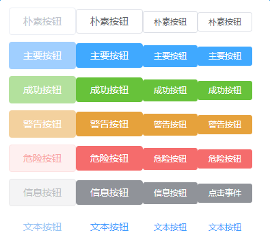

npm install -g create-react-app
create-react-app my-app --scripts-version=react-scripts-ts


***
"ordered-imports": false 引入资源不需要按字母顺序排列

"no-console": [ false ] 允许使用 console.log

"jsx-boolean-value": [true, "never"] 允许属性为true时 可以省略 <Button disabled></Button>

***
### 按钮
>按钮类型 primary/success/warning/danger/info/text

```html
 <Button type="warning">警告按钮</Button>
```

>按钮大小 small/medium/mini

```html
 <Button type="success" size="medium">成功按钮</Button>
```



### 输入框
```html
<Input type="password" defaultValue={inputDefaultValue} value={inputValue} onChange={this.onInputChange} />
```
>属性

| 参数 | 说明 | 类型 | 可选值 | 默认值 |
| :--- | :--- | :--- | :--- | :--- |
| type | 输入框类型 | string | text/password | text |