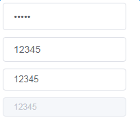

<p align="center" style="font-size:50px">YUI</p>
<p align="center">react UI框架</p>
<p align="center">
  <a href="https://travis-ci.org/Lucy20209060/YUI"></a>
</p>

备注：

* npm install -g create-react-app
* create-react-app my-app --scripts-version=react-scripts-ts
* "ordered-imports": false 引入资源不需要按字母顺序排列
* "no-console": [ false ] 允许使用 console.log
* "jsx-boolean-value": [true, "never"] 允许属性为true时 可以省略 <Button disabled></Button>

***
### 按钮

```html
<Button type="danger" size="mini">危险按钮</Button>
```

>属性

| 参数 | 说明 | 类型 | 可选值 | 默认值 |
| :--- | :--- | :--- | :--- | :--- |
| type | 按钮类型 | string | primary/success/warning/danger/info/text | primary |
| size | 大小 | string | small/medium/mini | |


### 输入框

```html
<Input type="password" defaultValue={inputDefaultValue} value={inputValue} onChange={this.onInputChange} />
```

>属性

| 参数 | 说明 | 类型 | 可选值 | 默认值 |
| :--- | :--- | :--- | :--- | :--- |
| type | 输入框类型 | string | text/password | text |



>Additional Information
